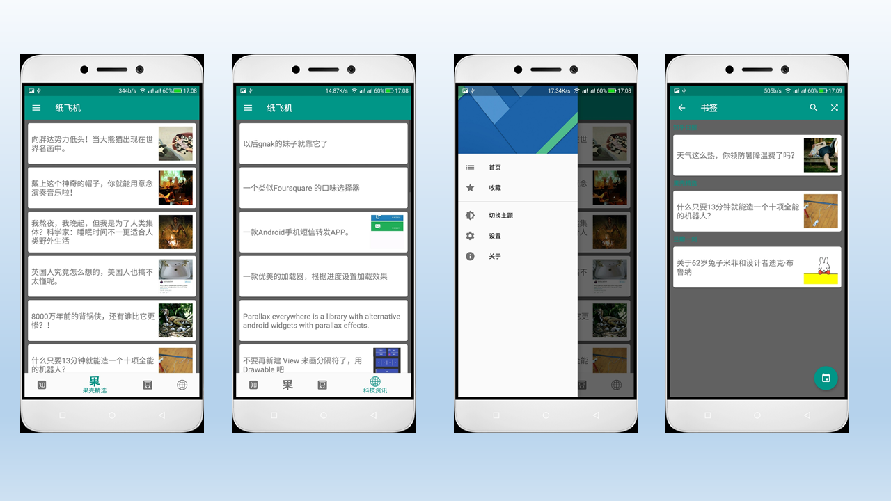
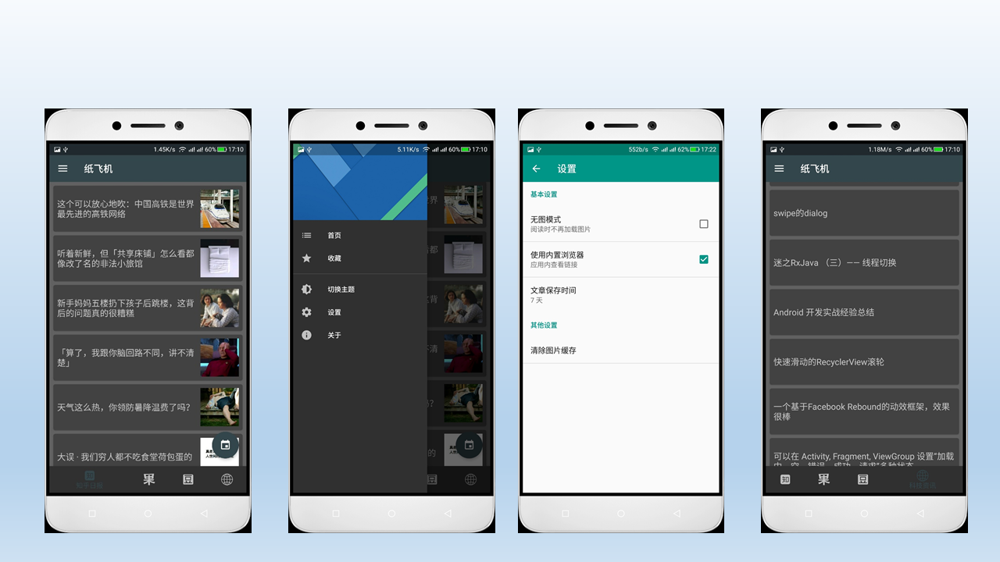
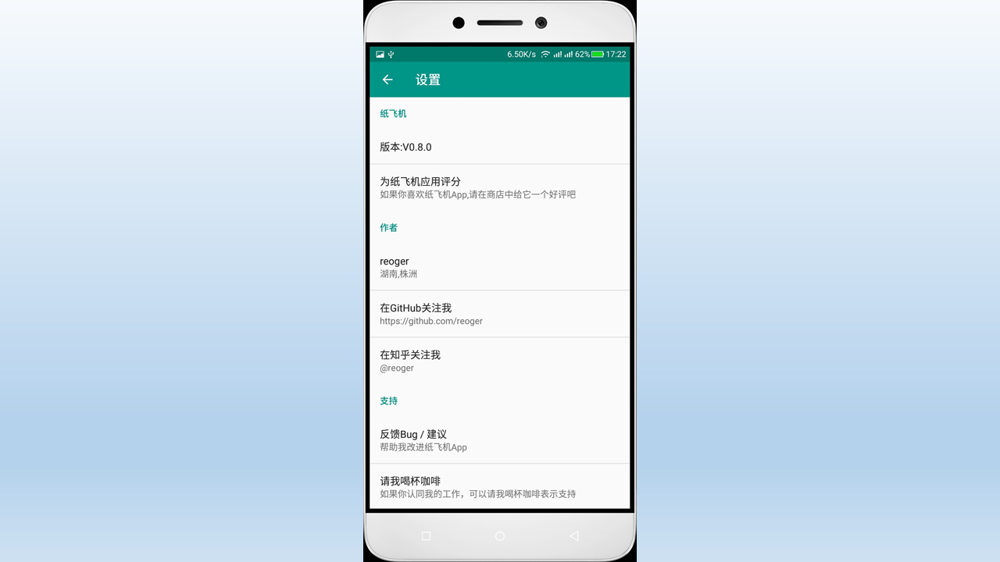

# PaperPlaner
--纸飞机

基于开源项目纸飞机<https://github.com/TonnyL/PaperPlane>实现。
效果图：

主要实现功能：
* 查看知乎日报，果壳日报，豆瓣新闻和android日报。
* 修改主题
* 收藏与取消收藏
* 设置相关参数
* 自动缓存和数据持久化

主要用到的开源库：

* compile 'com.android.support:appcompat-v7:25.3.0'
* compile 'com.android.support:preference-v14:25.3.0'
* compile 'com.android.support:design:25.3.0'
* compile 'com.android.support:support-vector-drawable:25.3.0'
* compile 'com.android.support:recyclerview-v7:25.3.0'
* compile 'io.reactivex:rxjava:1.0.14'
* compile 'io.reactivex:rxandroid:1.0.1'
* compile 'com.squareup.retrofit2:retrofit:2.2.0'
* compile 'com.squareup.retrofit2:converter-gson:2.0.2'
* compile 'com.squareup.retrofit2:adapter-rxjava:2.0.2'
* compile 'com.github.bumptech.glide:glide:3.7.0'
* compile 'com.android.support:cardview-v7:25.3.0'
* compile 'org.greenrobot:greendao:3.2.2'
* compile 'com.wdullaer:materialdatetimepicker:3.1.1'
* compile 'com.android.support:customtabs:25.3.0'
* compile 'com.android.support:support-v4:25.3.0'
* compile 'com.android.support.constraint:constraint-layout:1.0.2'

